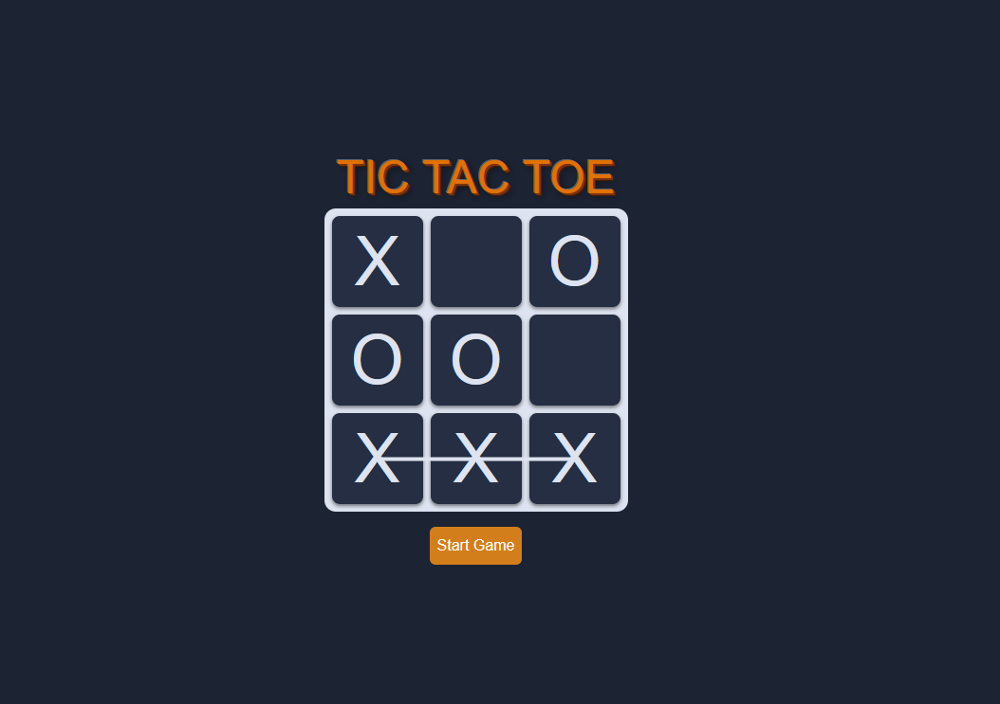
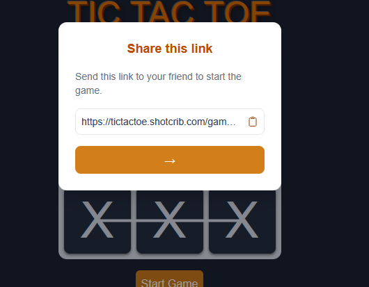
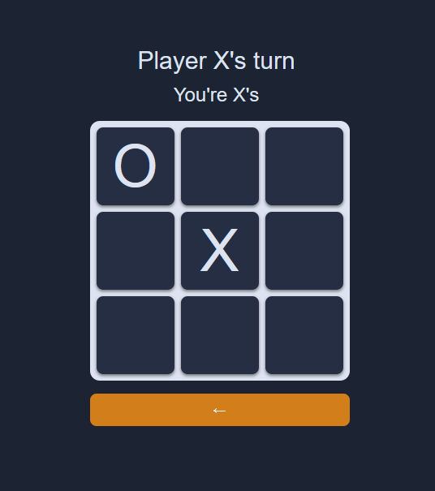
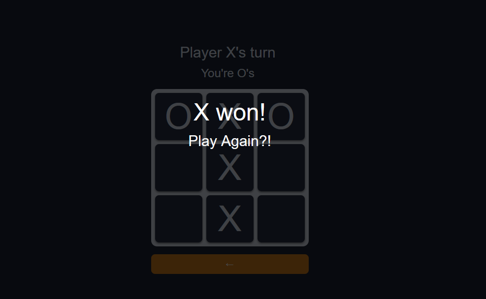

# Multiplayer Tic-Tac-Toe
A real-time multiplayer Tic-Tac-Toe game using WebSockets.
Available at: https://tictactoe.shotcrib.com
-------------------------------------------------------------
## Screenshots
| Home | Share | Playing | END |
|------|-------|---------| --- |
|  |  |  |  |

## Overview
Two players connect to the same game room by sharing a link to it. Then you take turns placing marks. The server manages game state and syncs moves instantly between clients using WebSockets.

## Tech Stack


## Setup
### Prerequisites
- Docker
  
### Installation
```bash
git clone https://github.com/ShotCrib77/websockets-tic-tac-toe
cd websockets-tic-tac-toe
docker build -t tic-tac-toe .
docker run -d -p 4000:4000 --name tic-tac-toe tic-tac-toe
```

## Notes
Relativly easy project. Fun to learn how persistent connections / websockets work. The biggest challange was to get an inital grasp of how socket.io works as well as remebering to allways have the server side as the "source of truth" for the game logic.

## License
[MIT](./LICENSE)
